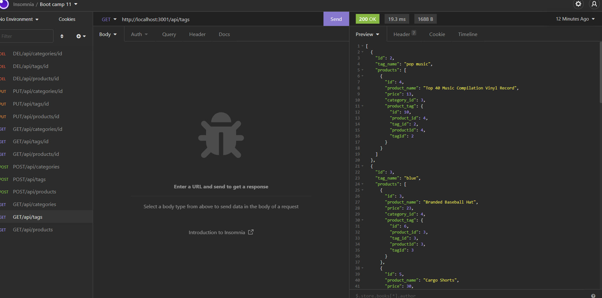

# E-Commerce-Back-End

(Homework - 13: Object-Oriented Programming: Team Profile Generator)

 

  
 

## Description:

Build a back end for an e-commerce site by modifying starter code. Configured a working Express.js API to use Sequelize to interact with a MySQL database.

 
 

## Table of contents:

  * [License](#license)
  * [Video](#video)
  * [Installation](#installation)
  * [Usage](#usage)
  * [Contributions](#contributions)
  * [Tests](#tests)
  * [Credits](#credits)
  * [Author](#author)
  * [Questions](#questions)

 
 
  
## License:
 
      -  MIT License - Copyright (c) 2022 Jason Yoo

 
 

## Video:

  
  
  
 

## Installation:
 
      -  Clone the files from my github repository provided below

 
 
  
## Usage: screenshots - (Highlighted Title(s) = a hyperlink to the direct image)

 

Once downloaded, open the file in VS Code.

 
  

[Screenshot1](images/Screenshot1.png)  "Results of node seeds/index.js in terminal"

[Screenshot2](images/Screenshot2.png)  "Results of node server.js in terminal"

 

[Screenshot3](images/Screenshot3.png)  "Insomnia - All Products"

 

[Screenshot4](images/Screenshot4.png)  "Insomnia - All Tags"

 

[Screenshot5](images/Screenshot5.png)  "Insomnia - All Categories"

 

[Screenshot6](images/Screenshot6.png)  "Insomnia - Adding A New Product"

 

[Screenshot7](images/Screenshot7.png)  "Insomnia - Adding A Tag"

 

[Screenshot8](images/Screenshot8.png)  "Insomnia - Adding A New Category"

 

[Screenshot9](images/Screenshot9.png)  "Insomnia - Searching Product By ID Number"

 

[Screenshot10](images/Screenshot10.png)  "Insomnia - Searching Tags By ID Number"

 

[Screenshot11](images/Screenshot11.png)  "Insomnia - Searching Categories By ID Number"

 

[Screenshot12](images/Screenshot12.png)  "Insomnia - Replacing Products With New Ones By ID Number"

 

[Screenshot13](images/Screenshot13png)  "Insomnia - Replacing Tags With New Ones By ID Number"

 

[Screenshot14](images/Screenshot14.png)  "Insomnia - Replacing Categories With New Ones By ID Number"

 

[Screenshot15](images/Screenshot15.png)  "Insomnia - Deleting A Product By ID Number"

 

[Screenshot16](images/Screenshot16.png)  "Insomnia - Deleting A Tag By ID Number"

 

[Screenshot17](images/Screenshot17.png)  "Insomnia - Deleting A Category By ID Number"

 
 

  
## Contributions:
 
Reach me at my email provided below to be added as a contributor.

 
 
  
## Tests: 
 
npm install express, sequelize, mysql2, nodemon and dotenv. Once they're installed, initiate the database by logging into your mysql account and sourcing the schema.sql. Then in terminal link your seeds by node seeds/index.js and run the server by node server.js. Then open the application in Insomnia. 
  
 
 

## Credits:
 
Much thanks to my brilliant tutor Mr. Faran Navazi for helping me start on a solid foundation for the development of this application.

 
 

## Author:
 
Jason Yoo
  
 
 

## Questions:
  For any questions regarding this application, you may reach me directly at jasonjayoo@outlook.com.

  To view my other applications, please check out my github page [jasonjayoo](https://github.com/jasonjayoo).
